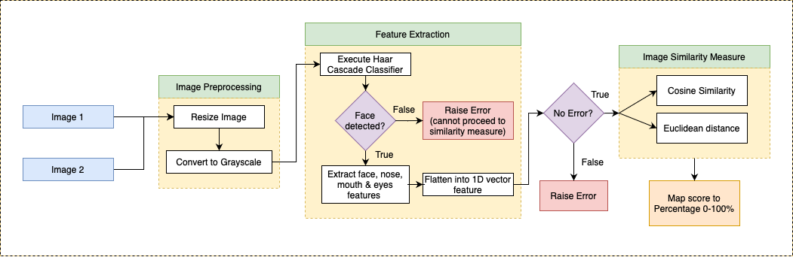

# Face Image Similarity OpenCV
A simple project on measuring two face images similarities using Cosine and Euclidean distance

This project involves building a facial recognition model that compares two images and returns a similarity score. 
  

 
The model follows the following steps:

## Preprocessing

The input images are preprocessed to ensure that they are in a consistent format. This typically involves:

- Resizing the images to the same size
- Converting the images to grayscale
- Applying other types of image enhancement techniques, as needed
## Feature Extraction

Features are extracted from the preprocessed images using:

- Haar Cascade Classifier
## Similarity Measurement

The similarity between the extracted features is calculated using a distance measure such as:

- Euclidean distance
- Cosine similarity

## Output

The calculated similarity score is returned. The score can be returned as is, or mapped to a certain range (such as 0 to 1) to indicate the level of similarity between the two images.

## Considerations

Building a facial recognition model involves several technical challenges and there are many factors that can affect its performance. It is important to carefully consider the choice of:

- Preprocessing techniques
- Feature extraction methods
- Similarity measure
- Training data quality and diversity
It is also important to test the model on a large and diverse set of images to ensure that it performs well in a variety of scenarios.

<h1>Running the Python Application</h1>

This guide covers the steps to set up a Python virtual environment and install the necessary dependencies to run the Python application.

<h2>Prerequisites</h2>
<ul>
  <li>Python 3</li>
  <li>pip (Python package manager)</li>
</ul>
<h2>Setting up a Python Virtual Environment</h2>

A Python virtual environment is an isolated environment that allows you to install packages and run Python applications without affecting the global Python installation on your system.

To create a Python virtual environment, follow these steps:

<ol>
  <li>Open a terminal window.</li>
  <li>Navigate to the directory where you want to create the virtual environment.</li>
  <li>Run the following command to create a virtual environment:
  <pre><code>python -m venv myenv</code></pre>
  Replace "myenv" with the desired name of your virtual environment.</li>
  <li>Activate the virtual environment by running the following command:
  <pre><code>source myenv/bin/activate</code></pre>
  Replace "myenv" with the name of your virtual environment.</li>
</ol>

Your virtual environment is now activated and you can begin installing the necessary dependencies.

<h2>Installing Dependencies</h2>

The dependencies for this Python application are listed in the <code>requirements.txt</code> file. To install these dependencies, run the following command:

<pre><code>pip install -r requirements.txt</code></pre>

This will install all the necessary packages in your virtual environment.

<h2>Running the Application</h2>

To run the Python application, navigate to the directory where the application is located and run the following command:

<pre><code>python main.py</code></pre>

Once the application finishes running, you can deactivate the virtual environment by running the following command:

<pre><code>deactivate</code></pre>

This will take you back to the global Python installation on your system. To reactivate the virtual environment at a later time, simply repeat the steps to create and activate the
